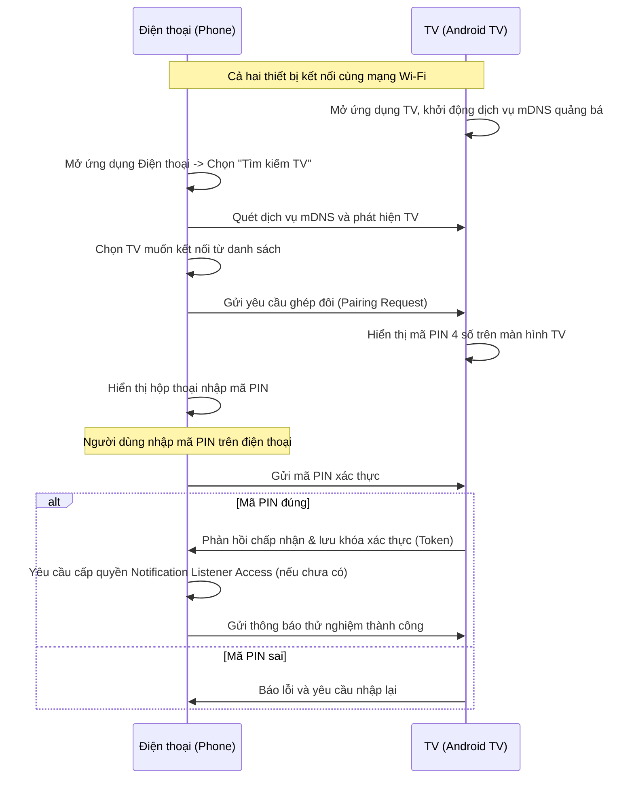

# Tài liệu Yêu cầu Sản phẩm (PRD) - TV Notification Mirror

Tài liệu này xác định các yêu cầu chức năng, phi chức năng và luồng trải nghiệm người dùng (UX) cho ứng dụng **TV Notification Mirror**.

---

## 1. Mục tiêu sản phẩm (Objectives)
* **Giải quyết vấn đề:** Giúp người dùng không bỏ lỡ thông báo quan trọng từ điện thoại khi đang tập trung xem TV.
* **Trải nghiệm tối giản:** Thông báo hiển thị trên TV phải nhỏ gọn, xuất hiện và biến mất tự động, không gây phiền toái cho người xem.
* **An toàn & Riêng tư:** Dữ liệu thông báo chỉ truyền trực tiếp từ Điện thoại sang TV trong mạng Wi-Fi nội bộ, không đi qua máy chủ trung gian.

---

## 2. Đối tượng mục tiêu (Target Audience)
* Người dùng sử dụng điện thoại chạy hệ điều hành Android.
* Gia đình hoặc cá nhân sở hữu Android TV / Google TV.

---

## 3. Các tính năng chính (Key Features)

### 3.1. Ứng dụng trên Điện thoại (Phone App)
* **Yêu cầu quyền truy cập thông báo:** Hướng dẫn người dùng cấp quyền `Notification Listener Access`.
* **Quét và kết nối TV:**
  * Tự động quét các thiết bị Android TV đang mở ứng dụng trong cùng mạng Wi-Fi thông qua mDNS.
  * Hỗ trợ nhập IP thủ công nếu không quét được.
  * Hiển thị danh sách TV khả dụng và trạng thái kết nối.
* **Bộ lọc thông báo (Notification Filter):**
  * Cho phép bật/tắt nhận thông báo từ từng ứng dụng cụ thể (ví dụ: chỉ nhận Zalo, Messenger, Cuộc gọi; tắt các app mua sắm, game).
  * Bộ lọc từ khóa (chỉ hiển thị thông báo chứa từ khóa quan trọng hoặc bỏ qua thông báo chứa từ khóa rác).
  * Chế độ "Riêng tư": Ẩn nội dung chi tiết tin nhắn, chỉ hiện tên người gửi và tên ứng dụng (ví dụ: *"Zalo: Tin nhắn mới từ Nguyễn Văn A"* thay vì hiển thị toàn bộ nội dung tin nhắn).
* **Trình giả lập thông báo (Test Notification):** Nút gửi thử một thông báo giả lập lên TV để kiểm tra kết nối.
* **Quản lý lịch sử truyền:** Xem lại các thông báo đã gửi lên TV.

### 3.2. Ứng dụng trên TV (TV App)
* **Chạy ngầm (Background Service):** Tự khởi động cùng TV (Boot Receiver) và luôn sẵn sàng nhận thông báo ngay cả khi ứng dụng không mở trên màn hình chính.
* **Hiển thị Overlay (Draw over other apps):**
  * Khi nhận thông báo, hiển thị một cửa sổ pop-up nhỏ gọn ở góc màn hình (mặc định là góc trên bên phải hoặc dưới bên phải).
  * Pop-up tự động ẩn sau một khoảng thời gian cấu hình được (ví dụ: 5 giây, 10 giây).
  * Hiển thị Icon ứng dụng gửi, tên ứng dụng, tiêu đề thông báo (Tên người gửi), và một phần nội dung (nếu không bật chế độ riêng tư).
* **Cấu hình giao diện trên TV:**
  * Cho phép chỉnh kích thước pop-up (Nhỏ, Vừa, Lớn).
  * Cho phép chỉnh độ trong suốt (Opacity) của cửa sổ pop-up.
  * Chọn vị trí hiển thị (4 góc màn hình).
* **Chế độ Không làm phiền (Do Not Disturb):** Bật/tắt nhanh tính năng nhận thông báo trực tiếp trên TV, hoặc lên lịch hẹn giờ tắt (ví dụ: không hiện thông báo sau 10 giờ đêm).
* **Quản lý thiết bị đã ghép đôi:** Danh sách các điện thoại được phép gửi thông báo lên TV, có quyền từ chối hoặc chặn thiết bị lạ.

---

## 4. Luồng trải nghiệm người dùng (User Flows)

### 4.1. Luồng ghép đôi lần đầu (First-time Pairing)

### 4.2. Luồng đẩy thông báo (Notification Mirroring)
1. Điện thoại nhận được tin nhắn mới từ Telegram.
2. `NotificationListenerService` trên điện thoại bắt được sự kiện.
3. Ứng dụng điện thoại kiểm tra bộ lọc:
   * Ứng dụng Telegram có được bật không? -> **Có**.
   * Từ khóa có bị chặn không? -> **Không**.
   * Chế độ riêng tư có bật không? -> **Không**.
4. Ứng dụng điện thoại mã hóa nội dung thông báo và gửi qua WebSocket tới ứng dụng TV.
5. Ứng dụng TV (Background Service) nhận được dữ liệu, giải mã.
6. Ứng dụng TV hiển thị Overlay Pop-up ở góc phải màn hình trong 6 giây.
7. Pop-up biến mất bằng hiệu ứng mờ dần (Fade-out).

---

## 5. Yêu cầu phi chức năng (Non-Functional Requirements)

* **Hiệu năng & Tài nguyên:**
  * Ứng dụng TV chạy ngầm phải tiêu thụ cực ít RAM (< 50MB) và CPU (< 1%) để không làm ảnh hưởng đến việc giải mã video 4K hoặc chơi game trên TV.
  * Ứng dụng Điện thoại chạy ngầm không gây hao pin đáng kể (sử dụng cơ chế push thụ động, chỉ gửi gói tin khi có thông báo thật).
* **Độ trễ (Latency):** Thời gian từ khi điện thoại nhận thông báo đến khi TV hiển thị pop-up phải dưới **1 giây**.
* **Độ tin cậy (Reliability):**
  * Tự động kết nối lại (Auto-reconnect) khi một trong hai thiết bị tạm mất kết nối Wi-Fi hoặc TV sleep rồi wake up.
  * Xử lý trường hợp IP thay đổi bằng cách tự động cập nhật qua mDNS.
* **Thiết kế TV UI:** Tuân thủ hướng dẫn thiết kế **Android TV / Google TV UX guidelines** (phông chữ lớn, độ tương phản cao, thao tác hoàn toàn bằng D-pad của Remote).
